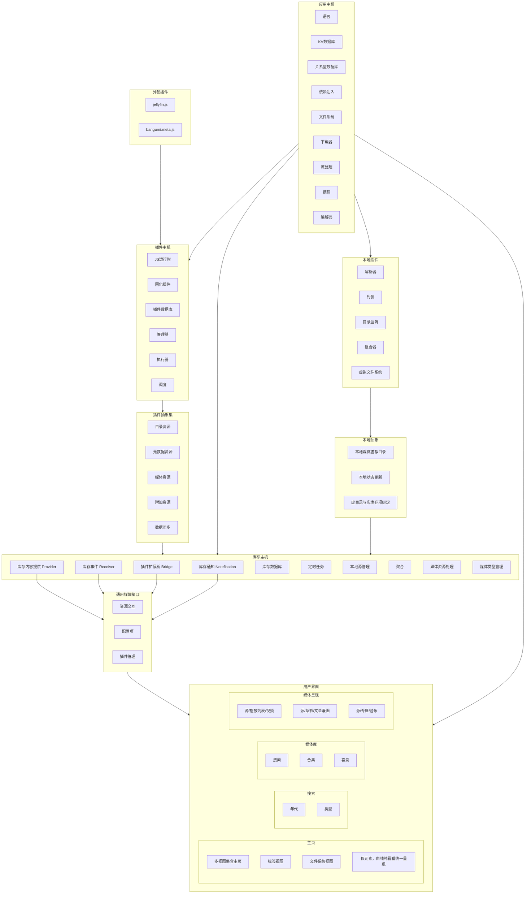
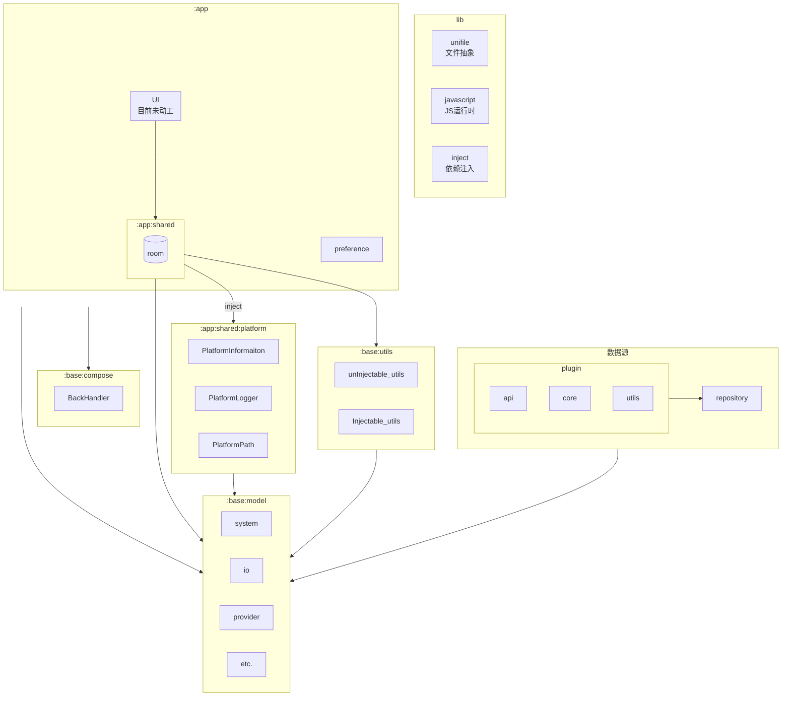

纯纯看番 KMP 项目，初步计划支持 Android, Desktop

* app 顶层壳模块，平台特化，依赖 shared 根模块 和 lib 模块
* shared 共享模块，主要业务逻辑所在，树形结构，分为根模块和子模块
* lib 底层库模块，比较独立的工具

其中 shared 为树形结构，并且 shared 子模块只能被其他 shared 子模块或者 shared 根模块依赖

# 项目架构（Cursor 生成）

架构分析如下：

## EasyBangumi 项目架构分析

### 一、整体架构概述

EasyBangumi 是一个 Kotlin Multiplatform (KMP) 项目，支持 Android 和 Desktop。采用分层模块化设计。

### 二、三层架构结构

```
┌─────────────────────────────────────┐
│          app 层（平台壳）             │
│  ┌──────────┐    ┌──────────┐      │
│  │ Android  │    │ Desktop  │      │
└──┼──────────┼────┼──────────┼──────┘
   └──────────┘    └──────────┘
         │               │
         └───────┬───────┘
                 │
┌────────────────┼─────────────────────┐
│      shared 层（业务逻辑核心）         │
│  ┌──────────────────────────────┐  │
│  │ shared (根模块)               │  │
│  ├── source (播放源)             │  │
│  ├── data (数据模型)             │  │
│  ├── foundation (基础组件)        │  │
│  ├── theme (主题)                │  │
│  ├── ktor (网络)                 │  │
│  └── ...                         │  │
└────────────────┼─────────────────────┘
                 │
┌────────────────┼─────────────────────┐
│        lib 层（底层工具库）            │
│  ┌──────────┐  ┌──────────┐        │
│  │ store    │  │ utils    │        │
│  │ unifile  │  │ logger   │        │
│  │ webview  │  │ ...      │        │
└──┴──────────┴──┴──────────┴────────┘
```

### 三、模块详细说明

#### 1. app 层（平台特化）

职责：平台入口和平台特定实现

模块：
- `app/android`: Android 应用入口
  - `EasyApplication.kt`: Application 类
  - `EasyActivity.kt`: 主 Activity
  - 依赖 Android 特定库（ExoPlayer 等）
- `app/desktop`: Desktop 应用入口
  - `Main.kt`: 主函数
  - 依赖 Desktop 特定库（VLC 等）

#### 2. shared 层（业务核心）

采用树形依赖结构：shared 子模块只能被其他 shared 子模块或 shared 根模块依赖。

核心模块：

##### 2.1 shared (根模块)
- 位置: `shared/src/commonMain/`
- 职责：UI 和业务编排
- 主要组件：
  - `ComposeApp.kt`: Compose 应用入口
  - `Router.kt`: 导航路由
  - `Scheduler.kt`: 模块初始化调度器
  - UI 组件：`compose/home`, `compose/media`, `compose/search` 等

##### 2.2 shared/source (播放源)
- 职责：播放源抽象与实现
- 结构：
  ```
  source/
  ├── api/          # 源接口定义
  ├── bangumi/      # Bangumi 元数据源
  ├── inner/        # 内置源实现
  └── core/         # 源核心逻辑
  ```
- 源类型：
  - Meta 源（如 Bangumi）：提供元数据、搜索、推荐
  - 播放源：提供搜索和播放
  - 加载方式：Inner（内置源码）或 JavaScriptPlugin（JS 插件）

##### 2.3 shared/data
- 职责：数据模型和数据库
- 包含：Cartoon、Episode、PlayInfo 等实体

##### 2.4 shared/foundation
- 职责：基础功能组件
- 包含：平台适配、通用工具等

##### 2.5 shared/ktor
- 职责：HTTP 客户端封装
- 特性：统一 HttpClient 配置、Cookie 管理

##### 2.6 shared/platform
- 职责：平台信息抽象
- 提供：`Platform` 接口（isDebug、versionCode 等）

##### 2.7 其他模块
- `shared/theme`: 主题系统
- `shared/preference`: 偏好设置
- `shared/playcon`: 播放控制
- `shared/scheme`: URI Scheme

#### 3. lib 层（底层工具）

##### 3.1 lib/store
- 职责：文件存储抽象
- 特性：跨平台文件读写、序列化存储
- 核心：`FileHelper` 接口、`AbsFileHelper` 实现

##### 3.2 lib/utils
- 职责：通用工具类
- 提供：协程提供者、路径提供者等

##### 3.3 lib/unifile
- 职责：统一文件系统抽象
- 特性：跨平台文件访问

##### 3.4 lib/webview
- 职责：WebView 抽象
- 实现：JCEF (Desktop)、WebKit (iOS)、Android WebView

##### 3.5 logger
- 职责：日志系统
- 特性：跨平台日志统一接口

#### 4. libplayer（播放器抽象）

```
libplayer/
├── api/          # 播放器接口定义
├── exoplayer/    # Android ExoPlayer 实现
└── vlcj/         # Desktop VLC 实现
```

#### 5. javascript（JS 运行时）

```
javascript/
├── rhino/        # Rhino JS 引擎（JVM）
└── quickjskt/    # QuickJS 引擎（跨平台）
```

### 四、依赖注入架构

使用 Koin 进行依赖注入：

#### 初始化流程：

1. 平台初始化（`Android.kt` 或 `Desktop.kt`）
   ```kotlin
   - 启动 Koin
   - 注册 Platform 实现
   - 注册平台特定组件
   ```

2. 业务模块初始化（`Scheduler.onInit()`）
   ```kotlin
   - sourceModule      # 源管理
   - storeModule       # 存储
   - dataModule        # 数据
   - themeModule       # 主题
   - preferenceModule  # 偏好
   - ktorModule        # 网络
   - caseModule        # 用例
   - bangumiModule     # Bangumi
   - cartoonModule     # 卡通
   ```

3. 源级初始化（`InnerComponentBundle`）
   - 每个源拥有独立的 Koin 实例
   - 动态加载源组件

### 五、核心设计模式

1. 依赖倒置：通过接口抽象平台差异
2. 模块化：清晰的模块边界和依赖规则
3. 插件化：支持 JavaScript 插件扩展
4. 分层架构：app → shared → lib
5. 依赖注入：Koin 管理对象生命周期

### 六、跨平台实现策略

1. Expect/Actual 机制
   - `Platform` 接口：平台信息抽象
   - `logger`: 日志平台实现
   - 文件系统：通过 `unifile` 统一

2. 编译时配置
   - `buildLogic/easy_config`: 自动生成 `BuildConfig`（包含 `IS_DEBUG`）
   - 根据构建类型生成不同配置

3. 条件依赖
   - Android: ExoPlayer
   - Desktop: VLC
   - 通过 `build.gradle.kts` 配置平台特定依赖

### 七、数据流

```
用户操作 
  ↓
Compose UI 
  ↓
ViewModel / Controller 
  ↓
Source (播放源) 
  ↓
Ktor (网络请求) / Store (本地存储)
  ↓
数据返回 → UI 更新
```

### 八、关键特性

1. 多源支持：可同时使用多个播放源和元数据源
2. 插件化架构：JS 插件扩展功能
3. 统一数据模型：跨源统一数据接口
4. 离线支持：本地缓存和存储
5. 跨平台 UI：Compose Multiplatform

### 九、构建系统

- Gradle Kotlin DSL
- 版本目录：`gradle/libs.version.toml`
- 自定义插件：`buildLogic/` 下
  - `EasyLibBuild`: 库构建插件
  - `EasyConfig`: 配置生成插件

整体架构清晰，模块职责明确，便于维护和扩展。


# Ayala 的奇思妙想（纯天马行空）
## 功能框图



1. ~~不要做成纯纯屯番~~（屯番好快乐啊）
2. 将本地源做成组件注入JS插件二次抽象是不错的方法，但是限制太大，等同于做了一个万能的第三方客户端
3. 插件是组件形式的，可以声明式，也能注册式

## 架构图



是不是很混乱，等何言自己改吧

## 关于~~如何重写~~奇思妙想

~~这是一个复杂的系统工程，难以做到尽善尽美，及其容易顾此失彼，究竟是该侧重于数据源测呢还是倾向于元数据源测呢，该设计何种API以提供二级功能呢，这是一个很难回答的问题。~~

本地CMS，带点插件可以提供额外功能，还能在局域网里互相提供资源，没错，就是为了愉快的看番！

--Ayala评

计划是作为一个媒体中间件的概念做设计，该中间件需要有多个输入端和多个输出端。

资源应当予以分类

1. 目录资源：目录资源是指资源的目录结构，比如文件夹、Jellfin的媒体库、某个视频网站的首页、搜索等。
2. 元数据源：元数据源是指资源的元数据，比如视频的标题、封面、简介等，具体可以来自TMDB、豆瓣、Bangumi等。
3. 媒体源：媒体源是指资源的实际内容，比如视频、音频、图片、电子书、RSS等，媒体枚举也包含在该源内。
4. 附加项目源：附加项目是指资源的附加内容，比如字幕、评论、弹幕等。

资源分为目录类型、请求类型以及载入类型：

1. 目录类型可以直接是Jellfin的媒体库（文件夹）或是本地网络上的NAS或者是托管的本体源或者是任意文件夹，由于目录不一定什么情况下都有写权限，关于目录的索引会保存到本地的数据库。
2. 请求类型指的是资源的读权限相对受限的情况，比如远程的Jellfin的媒体库，这种情况下需要通过Jellfin的API来获取资源。
3. 载入类型指的是资源的读取具有延迟的情况，比如无法流式传输的资源、BitTorrent的资源、需要解密的资源等。

对应的获取途径：

1. 文件系统（SMB等）
2. 网络请求（webdev、RESTful API、RPC等）
3. 下载器（bittorrent，csv等）

资源管理与媒体源可以进行组合，比如请求类型的目录资源、载入类型的媒体源、目录类型的元数据源（Jellyfin的媒体库文件夹）等，具体实现逻辑交由插件实现，这里仅提供思路，
**纯纯看番仅对资源进行实现**。

资源的呈现方式并不唯一，但是应该实现一个层级，在这一层级之上可以是用户界面，也可以是web服务器，甚至可以作为封装库被其他APP使用。

### 插件主机

插件主机为每个插件实例化一个plugin接口，插件作者在plugin上注册自己的插件，并实现某一种拦截器。

每种数据源会被拆分为多个步骤，插件开发者可以实现一些步骤使得插件具备某些功能，这些步骤应当以异步拦截器的形式存在，需要完成某些到步骤后，资源才能开始呈现到用户。

比如用js实现插件源可以这样：

```js
// @key com.ayala.ebplugin.jellfin
// @label Jellyfin
// @versionName 1.6
// @versionCode 7
// @libVersion 11
// @cover https://jellyfin.org/images/favicon.ico

// 为了在不执行插件代码的情况下还能获取插件元数据，需要额外补充一个头部

// 话说为啥不直接在头部塞个json，然后在插件注册阶段注入回来啊？

// 插件注册，不可以异步执行，如果插件加载超过一定时间直接视为加载失败
plugin.register({
  name: 'Jellfin',
  description: '提供对Jellyfin服务器的支持',
  package: 'com.ayala.ebplugin.jellfin',
  keyword: ['jellfin', 'localmedia'],
  version: '1.0.0',
  minHostVersion: 1,
  icon: 'icon.png',
  access: ['network', 'fs-read', 'fs-write'， 'internal-aria', 'notefication'， 'webview'， 'uri', 'pipeline', 'interceptor'],
  preferrence: {
    server: {
      type: 'input',
      name: '服务器地址',
      default: 'http://localhost:8096',
      description: 'Jellyfin服务器的地址，例如http://localhost:8096'
    },
    username: {
      type: 'input',
      name: '用户名',
      default: 'admin',
      description: 'Jellyfin服务器的用户名'
    },
    password: {
      type: 'password',
      name: '密码',
      default: 'password',
      description: 'Jellyfin服务器的密码'
    },
    action_login: {
      type: 'action',
      name: '登录',
      description: '登录到Jellyfin服务器',
      action: async (config) => {
        // 登录到Jellyfin服务器
      }
    }
  },
  repository : {
    url: 'https://xxxx.com/xxxx/xxxx.git',
    branch: 'master'
  }
})

// 插件生命周期实现
plugin.on_init(async () => {
  // 初始化插件
  // 在初始化过程中，插件可以检查自身是否拥有足够的权限
  // 具有权限后纯纯看番才会注入相应的接口，请务必不要脱离生命周期
  if (!plugin.has_access('network'))
    throw new AccessNotEncludedException('没有足够的权限')
})
plugin.on_close(async () => {
  // 关闭纯纯看番前执行
})
plugin.on_install(async () => {
  // 当安装插件后执行
})
plugin.on_uninstall(async () => {
  // 当卸载插件前执行
})

// 数据源相关

// 当注册directory后，插件视为具备目录资源，将会在纯纯看番主页展示该插件的一个标签页
// directory是插件唯一的，不可以与其他插件共享
plugin.directory(async tab => {
    // 你可以异步的获取插件应该展示的标签，标签可以重复定义，但是不能重名
    // 除了仿文件系统的标签，其余标签均具有缓存属性，但是在定义时可以设置每次访问都刷新
    tab.homepage('首页', async block => {
        // 当展示为首页时可以使用一些预制的组件
        block.carousel('热门', async () => {
            // 轮播图组件
        })
        block.horizontal_list('最近更新', async () => {
            // 水平列表组件
        })
        block.grid('', async (context) => {
            // 网格组件，可以用于展示更多
            // 此外，当不指定组件名称时，组件名称将被隐藏
        })
    })
    // 以下兼容老版更好的起始插件，应该是最先支持的
    tab.page('分类'， async subtab => {
        subtab.page('战斗', async (context) => {
            context.has_nextpage()
            return ...
        })
        subtab.page('热血', async (context) => { })
        subtab.page('泡面', async (context) => { })
    })
    // 你也可以直接以文件浏览器的形式展示
    tab.explorer('浏览' async fs => {
        // fs是一个抽象的文件系统对象，用于展示一个虚拟路径
        fs.on_list(async (path) => {
            // 列出目录下的内容
            // 返回虚路径对象以及若干错误
        })
        fs.on_open(async (path) => {
            // 打开文件，获取文件实媒体对象
        })
        fs.on_menu('删除', vfs.File_type, async (virtual_file) => {
            // 右键菜单，'删除'时干什么
        })
    })
    // 当你的插件只有一个tab时，将不会展示tab的名称
    tab.always_show_tab_name = true
})

// 当注册search后，插件视为具备搜索资源
plugin.search(async (context) => {
    context.page
    context.has_nextpage()
    return [] // 当返回空列表时，纯纯看番会认为没有更多的资源
})

// content_type有 bangumi(节目、电影都在这个分类下)，e_book, audio, image
plugin.info_of(content_type.bangumi, async (context) => {
    从 context.summary 获取并返回 info
    // 获取资源的描述信息，将会返回当前源能获取的所有信息
    // 之后也有可能调用相应pipeline获取更加详细的信息(meta_info)
    // 在这一步开始就应该区分资源的类型，比如是目录类型、请求类型还是载入类型，以及资源是否可以访问
    return ...
})

plugin.media_of(content_type.bangumi, async (context) => {
    // 获取资源的实际内容
    return ...
})

plugin.do_update(content_type.bangumi, async (context) => {
    // 检查资源是否有更新
    return ...
})

// Pipeline 相关

plugin.pipeline(pipeline.meta, content_type.bangumi, async (content) => {
    // 处理节目类型资源的元数据
    // 管道是一种后处理的特性，纯纯看番会优先展示已经获取到的元数据
    // 但是会额外调用管道（如果插件具有pipeline权限的话），管道可以对不完整元数据进行处理
    // 如果已经是详细的元数据了，也可以主动返回
    return content
})

// Interceptor 相关

// 附加项目资源由拦截器提供，旨在为具体资源提供弹幕、评论、进度支持
plugin.interceptor(interceptor.danmaku, content_type.bangumi, async (context) => {
    // 返回弹幕列表
})

plugin.interceptor(interceptor.comment, content_type.bangumi, async (context) => {
    // 返回评论列表
})

plugin.interceptor(interceptor.progress, content_type.bangumi, async (context) => {
    // 将进度同步到不知道哪里
})

```

这不一定是最万金油的做法，如果硬要在元数据源和数据源中分一个主次的话，我会更倾向于元数据源，但是考虑到纯纯看番应该会做到干净安装后没有任何插件的情况下，那么对于数据库的设计应该是跟占上风的。

新描述：不再采用拦截器而是直接问插件提供这个功能不，评论字幕弹幕什么的都可以本地提供，再写套插件改为云提供，总之做到就算不在线看也能有内容。


## 精简描述

可以看到以上两节写了大量废话，最终采用何种设计也未知，当发生具体的变化后将会把内容填充到下面。