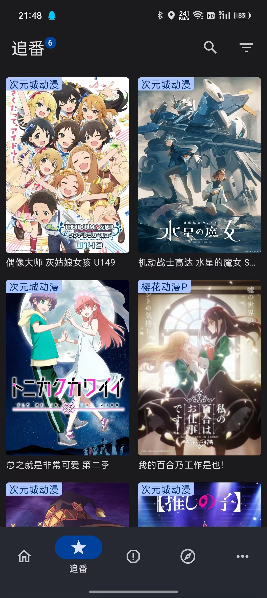
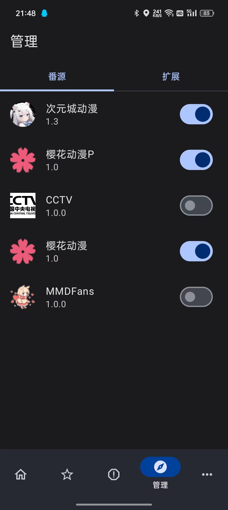
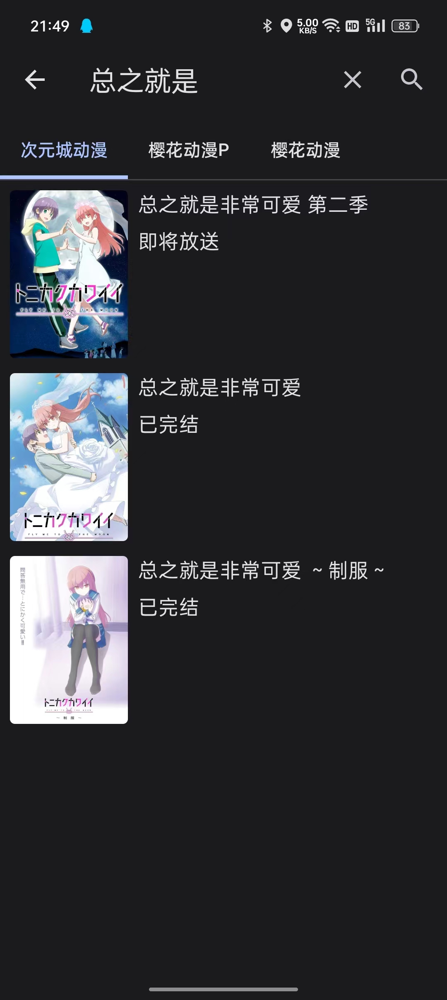

# 纯纯看番

  

  
  
  
  

# 下载

下载地址：[https://install.appcenter.ms/users/heyanle/apps/easybangumi/distribution_groups/easybangumi](https://install.appcenter.ms/users/heyanle/apps/easybangumi/distribution_groups/easybangumi)

# 开发计划

- [x] 番剧搜索
- [x] 首页推荐
- [x] 番剧收藏（追番）
- [x] 番剧播放
- [x] 多主题
- [x] 倍速播放
- [x] 播放历史
- [ ] 投屏功能
- [x] 添加源管理
- [ ] 添加弹幕功能
- [x] 插件化，添加插件市场
- [ ] 种子 & 磁力下载，添加种子站
- [ ] 种子站订阅，管理

# 反馈

点击链接加入群聊【纯纯看番】：[729848189](https://jq.qq.com/?_wv=1027&k=vyJ8l8M7)  
点击链接加入QQ频道【纯纯看番】：[https://pd.qq.com/s/4q8rd0285](https://pd.qq.com/s/4q8rd0285)  
点击链接加入 Telegram 群组【纯纯看番】：[https://t.me/easybangumi](https://t.me/easybangumi)

# 截图

|  |   |  |
|:---------------------------------:|:----------------------------------:|:----------------------------------:|
|  |  |  |

 

# 更新列表

- 2023/06/14 4.0.8  
  修复 全屏手势冲突（包括状态栏和全面屏底部小横线）   
  修复 源长按排序时会闪一下的问题  
  修复 关于界面图标颜色不对的问题  
  新增 反转播放列表功能（只有加入追番列表的番的反转状态会保存）  
  新增 全屏电量显示  
  新增 全屏标题显示  
  新增 连播功能  
  新增 全屏切换集数  
  优化 倍速和集数按钮和窗口的样式  
  优化 关于界面的图标  
  优化 现在番加载后会自动播放  

- 2023/06/04 4.0.7  
  修复 横屏 crash 的问题  
  修复 平板竖屏的问题  
  新增 倍速播放  
  优化 优化播放页面疯狂点击换集后播放错乱的问题  

- 2023/05/17 4.0.5 紧急更新  
  修复 搜索不了的问题  
  新增 平板模式    
  优化 扩展界面可以跳转到扩展应用详情

- 2023/05/17 4.0.5   
  新增 平板模式    
  优化 扩展界面可以跳转到扩展应用详情  
  
- 2023/04/14 4.0.4   
  修复 旧版本 webview 黑屏问题（增加兼容模式）  
  优化面板的图片列数  
  
- 2023/04/07 4.0.3
  全新 4.0 版本，全新 MD3 UI  
  添加 插件化，扩展可在官网或群下载  
  添加 番剧更新检测  

- 2023/02/18 3.1.3  
  新增 Omofun 源

- 2023/02/18 3.1.2  
  修复 次元城+ 源不认识追番的问题  
  修复 一些场景下的 Crash  
  优化 历史记录可以删除  
  优化 追番界面可以长按取消追番  
  优化 播放页返回按钮  
  优化 修复各页面中回到顶部按钮遮挡问题  
  

- 2023/02/12 3.1.1  
  修复 播放页跳转其他页面回来时会重新加载进度丢失的问题  
  修复 播放页数据无法成功复用的问题  
  修复 小窗点击放大按钮回到播放页有概率番剧源错误的问题  
  新增 投屏功能  
  新增 次元城 +  
  优化 部分源的规则完善体验

- 2023/02/10 3.1.0 紧急更新  
  修复 大部分源播放错误的问题

- 2023/02/09 3.0.9  
  修复 没有追番时追番列表有概率崩溃的问题  
  修复 播放页有概率崩溃的问题  
  新增 AGE 动漫源([https://www.agemys.net](https://www.agemys.net))

- 2023/02/05 3.0.8 紧急更新   
  修复 播放页进度不更新的问题

- 2023/02/05 3.0.7   
  修复 一堆播放页的 bug (重构)  
  修复 樱花动漫P源有时候线路错乱的问题  
  修复 3.0.7 将是最后一个升级会清数据的版本(历史遗留问题  
  优化 播放源现在具有保存文件，过 Cloudflare 的能力  
  优化 现在樱花动漫 P 部分可用，次元城可用   
  优化 优化一些界面的细节

- 2023/01/31 3.0.6
  新增 樱花动漫P源（暂时只能播放 MP4 格式）  
  新增 追番和历史中的回到顶部按钮  
  新增 小窗模式  
  优化 设置界面  
  修复 切换集时进度错乱问题  
  修复 播放完毕后一直显示重播按钮其他都操作不了的问题  
  修复 换番后播放器没清除还保留上一部番的某一帧的问题  
  修复 换番后在下面数据加载中上面播放器依然可以控制上一部番的问题  
  修复 点击搜索同名番后没选中当前源的问题  
  修复 搜索界面源选择无法持久化的问题  
  修复 主页加载时无法切换源的问题

- 2023/01/31 3.0.5
  新增 滑动进度条弹窗  
  新增 历史记录  
  新增 播放记忆  
  新增 搜索同名番  
  优化 现在主页和追番都可以下拉刷新  
  修复 Appcenter 自动更新在某些小米设备上 Crash  
  修复 非全屏下有几率显示锁定和选集按钮  

- 2023/01/27 3.0.4  
  新增 全屏视频 Title  
  新增 全屏选集  
  新增 自动连播  
  修复 次元城动漫 mp4 类型播放失败的问题  
  优化 给 Bimi 源加入代理  
  优化 现在全屏才能锁定

- 2023/01/26 3.0.3  
  新增 次元城动漫源 (https://www.cycdm01.top) 源，感谢 AyalaKaguya 的适配  
  修复 暂停时候播放暂停按钮不会跟着隐藏的问题

- 2023/01/24 3.0.2  
  修复 换集时有几率在加载状态但是没有加载条的问题  
  修复 手势滑动进度时有几率没有显示进度条的问题

- 2023/01/24 3.0.1  
  修复 播放器状态错乱问题  
  修复 Bimibimi 源退出全屏重新播放  
  优化 手势控制弹窗  
  优化 追番按钮  
  添加 缓冲条  
  添加 WebView 功能

- 2023/01/20 3.0 （数据不继承）  
  使用 Compose 重写，UI 更新  
  修复 无法锁定竖屏的问题  
  修复 哔咪动漫 看不了的问题

- 2022/06/12 2.0.2  
  修复 视频看不了的 BUG (忘记配置混淆)  
  修复 AGE 番剧源加载错乱的问题

- 2022/06/11 2.0.0  
  修复 无法回到上次进度问题  
  修复 全屏下滑动右侧屏幕崩溃问题  
  修复 我的追番界面数据不更新问题  
  添加 森之屋动漫 源  
  更新一堆 依赖 管理方式（增加源码可读性）

- 2022/05/16 1.1.1  
  修复 所有番剧源找不到的问题
  更新播放核心（ExoPlayer）

- 2022/04/17 1.1.0 （中间隔了几个版本没写）  
  修复 所有番剧源找不到的问题

- 2021/10/29 1.0.2  
  修复 AGE 番剧源找不到的问题  
  修复 首页 一个滑动冲突场景问题  
  因签名文件丢失，需卸载旧版

- 2021/10/22 1.0.1
  新增 AGE 番剧源（使用 WebView 抓包）  
  重写播放界面，增强稳定性

- 2021/10/10 1.0.0  
  完成大体  
  樱花动漫与哔咪动漫源  

