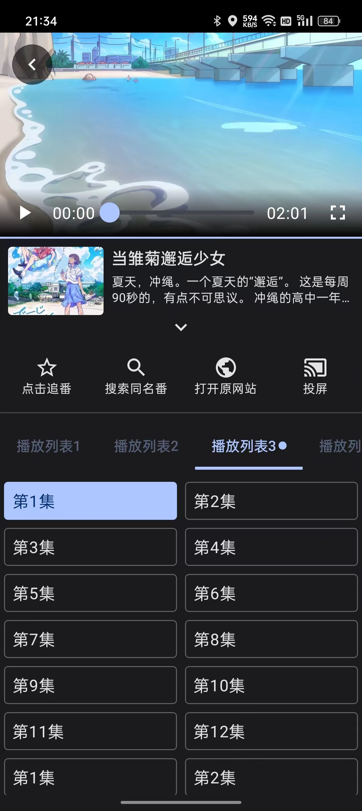

# 纯纯看番

  

  
  
  
  

# 须知

1. 纯纯看番是为了学习 Jitpack compose 和音视频相关技术进行开发的一个项目，官方不提供打包和下载，其源代码仅供交流学习。因其他人私自打包发行后造成的一切后果本方概不负责。
2. 纯纯看番打包后不提供任何视频内容，需要用户自己手动添加。用户自行导入的内容和本软件无关。
3. 纯纯看番源码完全免费，在 Github 开源。用户可自行下载打包。如果你是收费购买的本软件，则本方概不负责。

# 开发计划

- [x] 番剧搜索
- [x] 首页推荐
- [x] 番剧收藏（追番）
- [x] 番剧分类
- [x] 番剧播放
- [x] 多主题
- [x] 倍速播放
- [x] 播放历史
- [x] 投屏功能
- [x] 添加源管理
- [x] 番剧下载
- [x] 数据保存，恢复
- [x] 插件化，添加插件市场
- [ ] pc 版
- [ ] 保存数据云同步
- [ ] 添加弹幕功能
- [x] 视频录制 Gif
- [ ] 基于 Bangumi 的刮削功能
- [ ] 基于 Bangumi 的数据同步功能

# 支持我们

学习不易，如果你觉得源码对你有帮助，请扫码给开发者加个鸡腿吧！

|  |   |
|:---------------------------------:|:----------------------------------:|

# 反馈

点击链接加入群聊【纯纯看番】：[729848189](https://jq.qq.com/?_wv=1027&k=vyJ8l8M7)  
点击链接加入QQ频道【纯纯看番】：[https://pd.qq.com/s/4q8rd0285](https://pd.qq.com/s/4q8rd0285)  
点击链接加入 Telegram 群组【纯纯看番】：[https://t.me/easy_bangumi](https://t.me/easy_bangumi)

# 截图

|  |   |  |
|:---------------------------------:|:----------------------------------:|:----------------------------------:|
|  |  |  |

# [更新列表](https://github.com/easybangumiorg/EasyBangumi/blob/main/app/src/main/assets/update_log.txt)  

